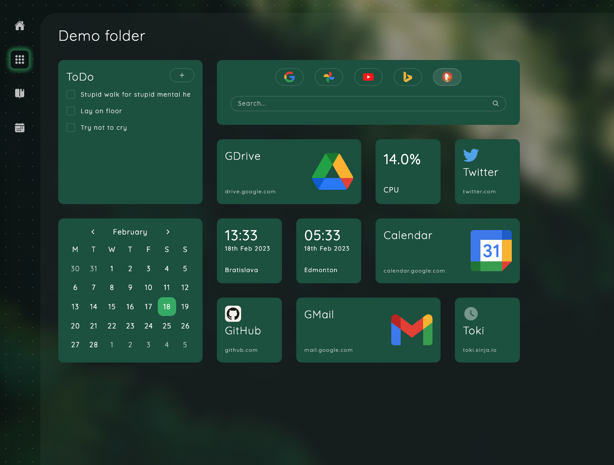

---

# Features

* Add widgets to homepage and organize them however you want
* Use bookmarks, calendar, todo, notes and other useful widgets
* Organize them in folders
* Quickly access your widgets using Cmd+K menu
* Choose from 6 different color schemes and backgrounds
* Supports Chrome, Firefox and Safari
* Easily extend app with your own widgets

    
Screenshot

    

    
Widgets

* Bookmark
* World time
* Notes
* Tasks
* Internet search
* Calendar
* Recently closed tabs (only Chrome & Firefox)
* CPU and RAM load (only Chrome)

# Installation

TODO: update links after publishing extension

* If you use Chrome or any browser based on Chromium -> install extension from [Chrome Web Store](https://chrome.google.com/webstore/category/extensions)
* If you use Firefox -> install extension from [Firefox Browser Add-ons](https://addons.mozilla.org/en-US/firefox/)
* If you use Safari -> sorry, but you'll need to build this extension from soruces. Please reffer to [documentation](/DEVELOPMENT_AND_EXTENDING.md) for details.

# Building from sources and extending

All details about building from sources and extending app with your own widgets are in [separate document](/DEVELOPMENT_AND_EXTENDING.md).